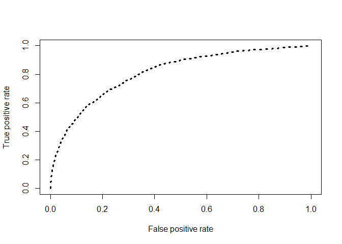
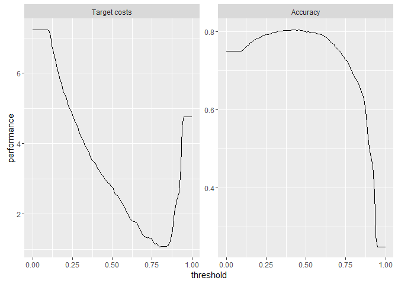

Cost-Sensitive Churn Classification
================

Problem and Data Overview
-------------------------

The dataset "all\_events" contains data about a customer's route through a ecommerce website. The website hosts products sold by different merchants. Products can be searched on a search page while separate product pages provide details on different products. Finally, payment gateway visits (which are assumed to be converted purchases) are also captured in the data. The dimensions in the dataset are further described below:

-   cust\_id - customer identification number
-   timestamp -time of event
-   event - description of which page the customer visited. Values are "search\_page","product\_page","purchase". "purchase" indicates that the customer has made a purchase.
-   merchant\_id - merchant identification number
-   prod\_type - product category
-   price - the price of the product being searched/viewed/purchased
-   product\_id - product identification number

Based on the event data provided, the e-commerce website is looking to run a retention campaign for users who are likely to churn in the near future. However, it also wants to optimize its marketing budget and does not have the resources to reach out to all of its customers.

We will attempt to build a churn model that predicts potential churners with reasonable accuracy and will also be cost-aware, in that it will be fed a cost-matrix that encodes benefits/loss of making a correct/incorrect prediction.

Defining Churn
--------------

In real-world churn modelling projects, the criteria that define churn are often decided based on significant domain expertise and exploratory data analysis. For our purposes, we will approximate the value of a customer based on his/her gross purchase amount till date and consider the loss of such customer to be an example of churn. To do this, we will inspect the distribution of total spends per customer.

``` r
overview <- all_events %>%
   dplyr::filter(event == "purchase") %>%
   filter(price < 250) %>%
   dplyr::group_by(cust_id) %>% 
 dplyr::summarise(total_bought = sum(price))

summary(overview$total_bought)
```

    ##     Min.  1st Qu.   Median     Mean  3rd Qu.     Max. 
    ##     0.01    11.00    23.05    50.58    50.07 26560.00

We see that the data is skewed with a median spends amount of 23$ and a mean of $50.58. We will pick a number between these two figures to define a "valuable" customer: $35.

For the purposes of identifying such customers who churn for the training data, we will look to the timeline below:


The data from interval colored in orange is used to identify valuable customers who transact in gross amounts exceeding $35.

``` r
train_active  <- all_events %>%
  filter(timestamp < '2014-08-01' &  
                timestamp >= '2014-04-01' & 
                event == "purchase") %>%
  group_by(cust_id) %>% 
  summarise(total_bought = sum(price)) %>% 
  filter(total_bought >= 35) 
```

Once valuable customers are identified, we label customers in this group to have churned if they are unavailable in the following four-month period (marked green). In this manner we identify a 1/0 churn flag for the customer base of interest.

``` r
train <- train_active %>% left_join(all_events %>% 
                                     filter(timestamp >= "2014-08-01" &
                                            timestamp < "2014-12-01" &
                                            event == "purchase") %>% 
                                     select(cust_id) %>% 
                                     unique() %>%
                                     mutate(still_there = 1),by=c("cust_id")) %>%
          mutate(target = ifelse(is.na(still_there) == TRUE,0,1)) 
```

Feature Engineering
-------------------

Now that the target variable has been established, we will look to develop features that help in predicting churn. We will develop variables dependent on different intervals of time during a customer's relationship with the website. Our features will fall into three broad categories:

### Long Term Variables


These variables capture characteristics of customer behaviour for 8 months prior to the hypothesized churn period. The length of this period is arbitrary; we consider a time period twice the length of the churn period (4 months) to be representative of customer behavior. We calculate the following metrics for defining these features on a customer level: \* Number of products viewed \* Number of distinct products viewed \* Variety of product categories viewed \* Variety of sellers considered \* Total amount transacted \* Number of products bought

The long term variables provide a good benchmark on which short-term variables (derived later) can be assessed by the model. We look to take ratios of these variables to make this benchmarking more unambiguous to potential machine learning algorithms.

``` r
  long_term <- 
    all_events %>% 
    filter(timestamp <  '2014-08-01' &
           timestamp >= '2013-12-01') %>%
    group_by(cust_id) %>% 
    summarise(
      products_viewed =  sum(!is.na(product_id)),
      distinct_products = n_distinct(product_id),
      distinct_prod_types= n_distinct(prod_type),
      distinct_merchants = n_distinct(merchant_id),
      amount_bought = sum(price[event == "purchase"],na.rm=TRUE),
      products_bought = sum(event == "purchase",na.rm=TRUE)) %>% 
    ungroup()
  
  names(long_term) = map_chr(names(long_term), function(x) paste(x,"LT",sep ="_"))
```

### Short Term Variables


These variables capture characteristics of customer behaviour for 1 month prior to the hypothesized churn period. Once again, the length of this period is arbitrary; we considered 1 month to accurately capture change in customer behavior in the recent past. For this period we calculate the same metrics as in the Long Term scenario.

``` r
  short_term <- all_events %>% 
    filter(timestamp <  '2014-08-01' &
             timestamp >= '2014-07-01') %>%
    group_by(cust_id) %>% 
    summarise(
      products_viewed =  sum(!is.na(product_id)),
      distinct_products = n_distinct(product_id),
      distinct_prod_types= n_distinct(prod_type),
      distinct_merchants = n_distinct(merchant_id),
      amount_bought = sum(price[event == "purchase"],na.rm=TRUE),
      products_bought = sum(event == "purchase",na.rm=TRUE)) %>% 
    ungroup()

  names(short_term) = map_chr(names(short_term), function(x) paste(x,"ST",sep ="_"))
```

### Lifetime Variables


These variables capture metrics describing properties of the customer's entire lifetime. For this period, we calculate: \* Total purchase amount \* Total products bought \* Total time elapsed since customer entry into data

``` r
  lifetime <- all_events %>%
    filter(timestamp < '2014-08-01') %>%
    group_by(cust_id) %>% 
    summarise(amount_bought = sum(price[event == "purchase"],na.rm=TRUE),
              products_bought = sum(event == "purchase",na.rm=TRUE),
              active_time = difftime('2014-08-01',min(timestamp))) 
  
  names(lifetime) = map_chr(names(lifetime), function(x) paste(x,"LFTIME",sep ="_"))
```

The customers in train are then joined to the datasets derived so far.

``` r
  train <- train %>% left_join(long_term,by=c("cust_id"="cust_id_LT")) %>%
    left_join(short_term,by=c("cust_id"="cust_id_ST")) %>%
    left_join(lifetime,by=c("cust_id"="cust_id_LFTIME")) 
  
  train["active_time_LFTIME"] = as.numeric(train$active_time_LFTIME)
  train[is.na(train)] <- 0
```

Here we derive the ratios of the short term variables to the long term variables. If there is no significant difference between the short-term and long-term behavior of a customer, these ratio variables should be close to 1. If the ratios are significantly lower, this may indicate disengagement and should be good indicators for potential churn.

``` r
  final_train <- train %>% mutate(
    ratio_products_viewed = products_viewed_ST/products_viewed_LT,
    ratio_distinct_products = distinct_products_ST/distinct_products_LT,
    ratio_distinct_prod_types = distinct_products_ST/distinct_products_LT,
    ratio_distinct_merchants = distinct_merchants_ST/distinct_merchants_LT,
    ratio_amount_bought = amount_bought_ST/amount_bought_LT,
    ratio_products_bought=products_bought_ST/products_bought_LT,
    amount_per_time = amount_bought_LFTIME/active_time_LFTIME,
    product_per_time  = products_bought_LFTIME/active_time_LFTIME)
```

Test Data Preparation
=====================

For the test, the above process is rerun with only one change: all the colorful windows are moved four months to the right as shown below:


From the above we are hoping to acheive a test dataset comparable to our train dataset. There are some caveats for setting up test/train datasets in this manner:

1.  We assume that a customer who is unavailable for 4 months at a stretch will not make an appearance later on in the dataset. If such is not the case, data leakage is certain. In actual project-work, quality checks are made to make the required adjustments.

2.  Effects of seasonality are ignored here. A review of churn rates over an extended period of time would help in understanding if seasonality is an important factor in a churn prediction problem.

We rerun the feature engineering for the test datasets below.

``` r
test_active  <- all_events %>%
  dplyr::filter(timestamp < '2014-12-01' &
                  timestamp >= '2014-08-01' &
                  event == "purchase") %>%
  dplyr::group_by(cust_id) %>% 
  dplyr::summarise(total_bought = sum(price,na.rm=TRUE)) %>% 
  dplyr::filter(total_bought >= 30) 

test <- test_active %>% 
  left_join(all_events %>% 
  filter(  timestamp >= "2014-12-01" &
           timestamp < "2015-03-01" &
           event == "purchase") %>% 
  select(cust_id) %>% 
  unique() %>%
  mutate(still_there = 1),by=c("cust_id")) %>%
  mutate(target = ifelse(is.na(still_there) == TRUE,0,1)) 
  
long_term_test <- 
  all_events %>% 
  filter(timestamp <  '2014-12-01' &
         timestamp >= '2014-04-01') %>%
  group_by(cust_id) %>% 
  summarise(
    products_viewed =  sum(!is.na(product_id)),
    distinct_products = n_distinct(product_id),
    distinct_prod_types= n_distinct(prod_type),
    distinct_merchants = n_distinct(merchant_id),
    amount_bought = sum(price[event == "purchase"],na.rm=TRUE),
    products_bought = sum(event == "purchase",na.rm=TRUE)) %>% 
  ungroup()

names(long_term_test) = map_chr(names(long_term_test), function(x) paste(x,"LT",sep ="_"))

short_term_test <- all_events %>% 
  filter(timestamp <  '2014-12-01' &
           timestamp >= '2014-11-01') %>%
  group_by(cust_id) %>% 
  summarise(
    products_viewed =  sum(!is.na(product_id)),
    distinct_products = n_distinct(product_id),
    distinct_prod_types= n_distinct(prod_type),
    distinct_merchants = n_distinct(merchant_id),
    amount_bought = sum(price[event == "purchase"],na.rm=TRUE),
    products_bought = sum(event == "purchase",na.rm=TRUE)) %>% 
  ungroup()

names(short_term_test) = map_chr(names(short_term_test), function(x) paste(x,"ST",sep ="_"))

lifetime_test <- all_events %>%
  filter(timestamp < '2014-12-01') %>%
  group_by(cust_id) %>% 
  summarise(amount_bought = sum(price[event=="purchase"],na.rm=TRUE),
            products_bought = sum(event == "purchase",na.rm=TRUE),
            active_time = difftime('2014-12-01',min(timestamp))) 

names(lifetime_test) = map_chr(names(lifetime_test), function(x) paste(x,"LFTIME",sep ="_"))

final_test <- test %>% 
  left_join(long_term_test,by=c("cust_id"="cust_id_LT")) %>%
  left_join(short_term_test,by=c("cust_id"="cust_id_ST")) %>%
  left_join(lifetime_test,by=c("cust_id"="cust_id_LFTIME")) 

final_test["active_time_LFTIME"] = as.numeric(final_test$active_time_LFTIME)
final_test[is.na(final_test)] <- 0

final_test <- final_test %>% mutate(
  ratio_products_viewed = products_viewed_ST/products_viewed_LT,
  ratio_distinct_products = distinct_products_ST/distinct_products_LT,
  ratio_distinct_prod_types = distinct_products_ST/distinct_products_LT,
  ratio_distinct_merchants = distinct_merchants_ST/distinct_merchants_LT,
  ratio_amount_bought = amount_bought_ST/amount_bought_LT,
  ratio_products_bought=products_bought_ST/products_bought_LT,
  amount_per_time = amount_bought_LFTIME/active_time_LFTIME,
  product_per_time  = products_bought_LFTIME/active_time_LFTIME)
```

Customer Lifetime Value Calculation
-----------------------------------

To build an effective cost matrix that measures the impact of errors our model makes, we will require the average customer lifetime value of a customer (CLV).

The end-to-end calculations to derive CLV are involved and require a deep understanding of financial analysis techniques. However, an approximate figure can be derived from most kinds of transaction data. We calculate the following metrics from the data in order to derive this rough estimate for customer lifetime value.

$$ \\text{Average Order Value} = \\frac {\\text{Total Purchase Amount}}{\\text{Total Number of Orders}}$$
$$ \\text{Purchase Frequency} = \\frac {\\text{Total Number of Orders}}{\\text{Total Number of Customers}}$$

Customer Value then can be defined by multiplying these two values:

Customer Value = Average Order Value \* Purchase Frequency

From these metrics, we have

$$ \\text{Customer Lifetime Value} = \\frac {\\text{Average Customer Lifetime}\*\\text{Customer Value}}{\\text{Total Days Observed}}$$

These figures can be calculated easily from the data as shown below:

``` r
valuable_customers <- all_events %>% 
  dplyr::filter(event == "purchase") %>%
  dplyr::group_by(cust_id) %>% 
  dplyr::summarise(total_bought = sum(price),count = n()) %>% 
  dplyr::filter(total_bought >= 35) %>% select(cust_id)

purchases_only <- all_events %>% 
  filter(event == "purchase") %>% 
  filter(price < 250) %>%
  filter(cust_id %in% valuable_customers$cust_id)

distinct_userids_n <- length(unique(purchases_only$cust_id))

average_order_value <- sum(purchases_only$price,na.rm=TRUE)/nrow(purchases_only)
purchase_freqeuncy <- nrow(purchases_only)/distinct_userids_n
customer_value <- average_order_value*purchase_freqeuncy

days_of_observation <- difftime(max(purchases_only$timestamp,na.rm=TRUE),
                        min(purchases_only$timestamp,na.rm=TRUE)) %>% as.numeric()

LV_Data <- all_events %>% 
  filter(cust_id %in% valuable_customers$cust_id) %>%
  group_by(cust_id) %>%
  summarise(max= max(timestamp,na.rm = TRUE),
            min = min(timestamp,na.rm = TRUE),
            lifetime = difftime(max(timestamp,na.rm = TRUE),
                                min(timestamp,na.rm = TRUE)),
            no_of_appearances=n()) %>% 
  ungroup()

average_lifetime <- mean(LV_Data$lifetime,na.rm=TRUE) %>% as.numeric()
customer_lifetime_value <- average_lifetime*customer_value/(days_of_observation)
customer_lifetime_value
```

    ## [1] 28.84079

Cost Matrix Derivation
----------------------

Now that we have derived lifetime customer value to be about $29, we can go ahead and construct our cost matrix. In addition to the CLV, we will also assume the following estimates:

-   The cost of reaching out to a customer through mail or otherwise roughly approximates to $2 per customer.
-   The retention campaign is focused on giving a $10 dollar giftcard to customers who are identified to be potential churners by the model.
-   The cost of losing a customer is the CLV.

Our cost matrix will consist of the following entries:

#### True Positives

In this case, the model correctly identifies churners as such. This is the ideal result we'd like the model to produce as often as possible. Our costs in this case include the 10$ incurred by providing the retention offer plus the $2 involved in reaching out to the customer. However, we gain the CLV ($29) for that customer.In summary, the final cost figure is $10+$2-$29 = $-17.

#### False Positives

In this case, the model identifies non-churners as churners. Our costs consists of the 10$ incurred by the retention offer plus the $2 involved in reaching out to the customer. While we may have played safe in this case, it will cost us $12 per false positive.

#### False Negatives

This is the case we'd most like to avoid. Our model labels a churner to be non-churner. Due to this blind spot we lose the CLV for that customer. The final cost figure is $29.

#### True Negatives

We neither lose nor gain money in this case as we have correctly identified a non-churner to a non-churner.

The final cost matrix thus is:

| Metric   | Predicted = 0 | Predicted = 1 |
|----------|---------------|---------------|
| True = 0 | 0             | +12           |
| True = 1 | +29           | -17           |

The framework used to define the cost matrix can be extended to include more sophisticated patterns in customer behavior. An example would be including the probability of a customer accepting the retention offer within the True Positive calculation. A very interesting paper on this topic is available [here](https://link.springer.com/article/10.1186/s40165-015-0014-6)

Model Building
--------------

We choose the following features to be used in the model. From testing different features, we find that providing the short term trend variables along with ratios provide for the most accurate and cost-effective prediction.

``` r
final_train <- as.data.frame(lapply(final_train,as.numeric))
final_test <- as.data.frame(lapply(final_test,as.numeric))

final_train1_manual <- final_train[c("target","products_viewed_ST","distinct_products_ST","distinct_prod_types_ST","distinct_merchants_ST","amount_bought_ST","products_bought_ST","ratio_products_viewed","ratio_distinct_products","ratio_distinct_prod_types","ratio_distinct_merchants","ratio_amount_bought","ratio_products_bought","amount_per_time","product_per_time","amount_bought_LFTIME","products_bought_LFTIME","active_time_LFTIME")]

final_test1_manual <- final_test[c("target","products_viewed_ST","distinct_products_ST", "distinct_prod_types_ST","distinct_merchants_ST","amount_bought_ST","products_bought_ST", "ratio_products_viewed","ratio_distinct_products","ratio_distinct_prod_types","ratio_distinct_merchants","ratio_amount_bought","ratio_products_bought","amount_per_time","product_per_time","amount_bought_LFTIME","products_bought_LFTIME","active_time_LFTIME")]


final_train1_manual["target"] =  as.factor(final_train1_manual$target)
final_test1_manual["target"] =  as.factor(final_test1_manual$target)

train_task <- makeClassifTask(data = final_train1_manual, target = "target")
test_task <- makeClassifTask(data = final_test1_manual, target = "target")
```

The cost matrix calculated earlier is now entered as a parameter for the model.

``` r
costs = matrix(c(0, 29,12,-17),2)
colnames(costs) = rownames(costs) = getTaskClassLevels(train_task)

target.costs = makeCostMeasure(id = "target.costs", 
                               name = "Target costs", 
                               costs = costs,
                               best = -17, 
                               worst = 29)
```

The MLR library in R allows for a variety of classification algorithms to be deployed on datasets like ours. Here we run an XGBoost model on our train dataset and test the resulting model on the test dataset.

``` r
xgb_lrn <- makeLearner(cl = "classif.xgboost", predict.type = "prob")

#Grid search parameters
params <- makeParamSet(
  makeIntegerParam("max_depth",lower = 3L,upper = 5L),
  makeIntegerParam("min_child_weight",lower = 1L,upper = 2L),
  makeDiscreteParam("subsample",values = seq(0.5,1,0.1)),
  makeDiscreteParam("colsample_bytree",values = seq(0.5,1,0.1)),
  makeDiscreteParam("eta", values = seq(0.01,0.1,0.01)),
  makeDiscreteParam("nrounds", values = seq(100L, 300L, by = 100L)))

rdesc <- makeResampleDesc("CV", iters = 3)
ctrl <- makeTuneControlRandom(maxit = 25L)

set.seed(42)

invisible(mytune <- tuneParams(learner = xgb_lrn,
                               task = train_task,
                               resampling = rdesc,
                               measures = target.costs,
                               par.set = params,
                               control = ctrl,
                               show.info = FALSE))

lrn_tuned <- setHyperPars(xgb_lrn,par.vals = mytune$x)


invisible(xgmodel <- train(learner = lrn_tuned,
                 task = train_task))

xgpred <- predict(xgmodel,test_task)
```

Model Assessment
----------------

Now that the model has been built, we will assess its performance through confusion matrices and ROC curves.

``` r
pred <- prediction(xgpred$data$prob.1,xgpred$data$truth)
perf <- performance(pred,"tpr","fpr")

plot(perf,col="black",lty=3, lwd=3)
```



``` r
auc <- performance(pred,"auc")
auc <- unlist(slot(auc, "y.values"))
auc
```

    ## [1] 0.8109042

``` r
mlr::performance(xgpred, measures = list(acc,target.costs))
```

    ##          acc target.costs 
    ##    0.7994966    2.7454698

``` r
getConfMatrix(xgpred)
```

    ##        predicted
    ## true       0   1 -SUM-
    ##   0     4081 392   392
    ##   1      803 684   803
    ##   -SUM-  803 392  1195

While we find that we have a reasonable accuracy of 80%, our true positive rate is less than desirable (45%). To choose a better threshold, we plot cost and accuracy against multiple thresholds.

``` r
d = generateThreshVsPerfData(xgpred, measures = list(target.costs, acc))
plotThreshVsPerf(d)
```



Note that for the graphs above, the metric is plotted along the y axis. On the left graph, threshold is plotted against target costs on the Y axis. We can see from these graphs that we can raise the threshold up to 0.7 to minimize cost while still incurring only a small loss of accuracy.

``` r
xgpred = setThreshold(xgpred, c(s = 0.7))

mlr::performance(xgpred, measures = list(acc,target.costs))
```

    ##          acc target.costs 
    ##    0.7552013    1.3545302

``` r
getConfMatrix(xgpred)
```

    ##        predicted
    ## true       0    1 -SUM-
    ##   0     3480  993   993
    ##   1      466 1021   466
    ##   -SUM-  466  993  1459

While our accuracy has reduced slightly, our cost incurred has halved and our true positive rate has moved up to a respectable 68%.

Summary
-------

Churn is complex phenomenon involving several variables; many of which are not readily captured by data sources. However, with relatively simple techniques like the ones described so far, churn can be studied and predicted to a reliable precision. These techniques may also be extended further to describe churn more accurately.
